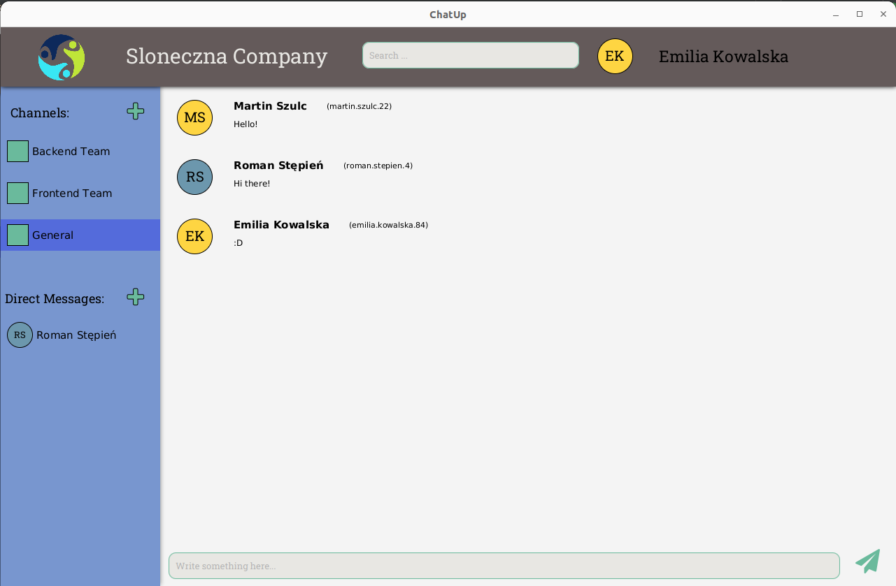

# Chatup

## Description
Messaging app (like Slack or Mattermost) developed for the purposes of Application Programming (PAP) course at the Warsaw University of Technology.
Main functionalities are creating channels and adding there users, real-time (RabbitMQ message broker) chat and efficient full-text searching provided by Elasticsearch.
User authentication is implemented using Spring Security and JWTs, GUI is created in JavaFX. 

Authors:
- [Dawid Kaszyński](https://github.com/dawidkasz)
- [Jan Kowalczewski](https://github.com/jkowalc)
- [Kajetan Rożej](https://github.com/Kajotello)
- [Mikołaj Szawerda](https://github.com/MikolajSzawerda)

## Installation
#### chatup_server
Run `docker compose build`. Then use`docker compose up` in order to start the server

#### chatup_client
You can use gradle, e.g. run `./gradlew build`.
Build can be found in `build/libs/chatup_client-1.0-SNAPSHOT.jar`.
Run the application by typing `java -jar build/libs/chatup_client-1.0-SNAPSHOT.jar`.

For the development purposes, you can use one of the predefined users 
from [data.sql](chatup_server/src/main/resources/data.sql) script to log in. 
Passwords are equal to the usernames.

### Technologies
- Frontend: Desktop app in JavaFX
- Backend: Spring, PostgreSQL, RabbitMQ, Elasticsearch
- Java17